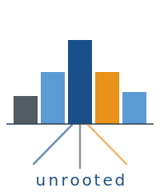

# unrooted

<div style="text-align:center; padding: 2em 0 1em;">
  
</div>

*Physics histogram analysis — without ROOT.*

`unrooted` is a Python library for reading, manipulating, and visualising histograms
from physics experiment data formats.  It works entirely within the Python ecosystem
using [uproot](https://uproot.readthedocs.io/) and [numpy](https://numpy.org/) —
no ROOT installation required.

---

## Quick example

```python
from unrooted.io.root import load
from unrooted.plot.mpl import plot, stamp, StyleSet

# Load a histogram from a ROOT file
h = load("analysis.root", "hx")

# Plot it with the ODD colour palette
ss = StyleSet.load("odd")
ax = plot(h, style=ss[0])

# Stamp the detector logo
stamp(ax, "odd")
ax.figure.savefig("plot.png")
```

---

## What's inside

| Module | Purpose |
|--------|---------|
| `unrooted.io.root` | Read ROOT histograms (`TH1`, `TH2`, `TProfile`) and TTree branches |
| `unrooted.core` | `Histogram` and `Axis` — the central data structures |
| `unrooted.plot.mpl` | Matplotlib backend: `plot`, `overlay`, `stamp`, `generate_stylesheet` |
| `unrooted.plot` | `HistogramStyle`, `StyleSet` — per-histogram and per-target theming |

---

## Logo concepts

Two SVG logo variants are provided for the library.

<div style="display:flex; gap:3em; align-items:flex-end; justify-content:center; padding:1.5em 0;">
  <div style="text-align:center">
    
    <p><em>A — Histogram-Tree</em></p>
  </div>
  <div style="text-align:center">
    
    <p><em>B — u-monogram</em></p>
  </div>
</div>

**Logo A** — five histogram bars in a Gaussian bell-curve arrangement; three thin
lines below the baseline represent roots being lifted.  Colors follow the ODD palette.

**Logo B** — the letter *u* formed by two bars of different heights (navy + amber)
connected at the bottom by a smooth arc.  Each bar reads as a histogram bin; the
whole shape reads as the initial of *unrooted*.  Scales well to favicon size.
