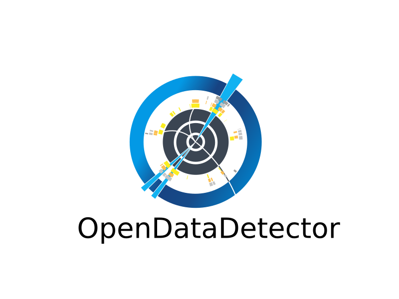

# Resources

The `resources/` directory bundles per-detector assets — logos and color palettes — that
can be used to give plots a consistent, experiment-specific look.

---

## Available targets

### sd — Super Duper (sample detector)

Used in unit tests and examples.

<div style="display:flex; gap:3em; align-items:center; padding:1em 0;">
  <div style="text-align:center">
    
    <p><em>full</em></p>
  </div>
  <div style="text-align:center">
    
    <p><em>line</em></p>
  </div>
</div>

### odd — OpenDataDetector

Real detector logos from the [OpenDataDetector project](https://github.com/acts-project/OpenDataDetector).

<div style="display:flex; gap:3em; align-items:center; padding:1em 0;">
  <div style="text-align:center">
    
    <p><em>full</em></p>
  </div>
  <div style="text-align:center">
    
    <p><em>line</em></p>
  </div>
</div>

---

## Color palettes

`colors.json` defines a four-color palette that `StyleSet` reads automatically:

```json
{
  "name": "odd",
  "description": "OpenDataDetector — steel blue, vivid orange, teal/seafoam, dark crimson red",
  "colors": ["#3A6FA8", "#E8721A", "#5BB8A8", "#9B2020"]
}
```

Load it with:

```python
from unrooted.plot import StyleSet
from unrooted.plot.mpl import plot

ss = StyleSet.load("odd")   # reads resources/odd/colors.json
ax = plot(h, style=ss[0])   # first of the four coordinated styles
```

See [Styles & Themes](styling.md) for the full `StyleSet` API.

---

## Logo files

Each target ships PNG and SVG variants of both the full-colour and line-art logos.
They are available for use in post-processing workflows or custom plot annotations.

```
resources/
├── sd/
│   ├── super_duper.png          full logo
│   ├── super_duper.svg
│   ├── super_duper_line.png     compact line-art variant
│   ├── super_duper_line.svg
│   ├── colors.json              four-color palette
│   └── stylesheet.png           auto-generated palette preview
└── odd/
    ├── odd_tech_light.png
    ├── odd_tech_light.svg
    ├── odd_tech_light_line.png
    ├── odd_tech_light_line.svg
    ├── colors.json
    └── stylesheet.png
```

---

## Adding a new target

Create a sub-directory under `resources/` and add a `colors.json` with four hex codes:

```json
{
  "name": "my_detector",
  "description": "Short description",
  "colors": ["#hex1", "#hex2", "#hex3", "#hex4"]
}
```

`StyleSet.load("my_detector")` and `generate_stylesheet("my_detector")` will then
work automatically.  Logo files are optional.
