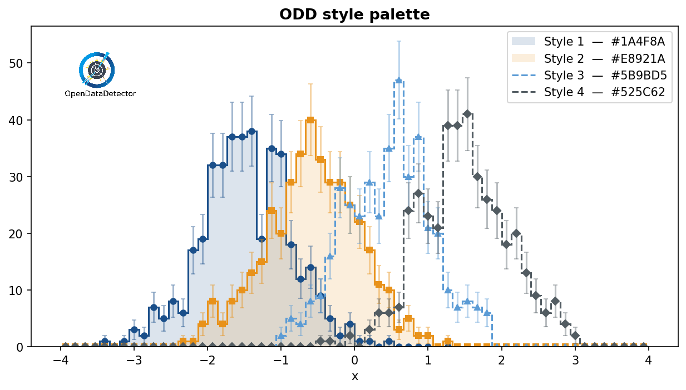
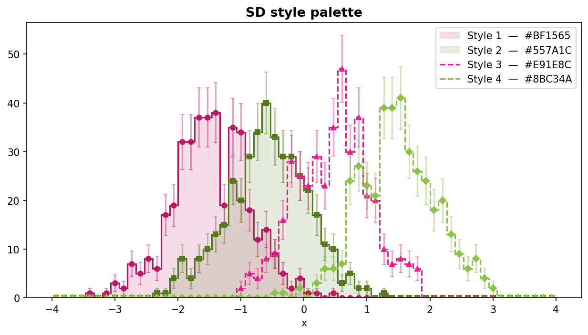

# Styles & Themes

## `HistogramStyle`

`HistogramStyle` is a dataclass that fully describes the visual appearance of a
single 1D histogram.  Use the **named constructors** for common patterns, or
build the dataclass directly for full control.

### Named constructors

Each constructor returns a fully configured `HistogramStyle` and accepts
`**overrides` to tweak individual fields:

```python
from unrooted.plot.style import HistogramStyle, LineStyle

# Step fill + error bars — default for count histograms
s = HistogramStyle.as_hist()

# Step line only — no fill, no error display
s = HistogramStyle.as_line()

# Markers at bin centres + error bars — no step line
s = HistogramStyle.as_markers()

# Markers + error bars + spread band — suited for efficiency histograms
s = HistogramStyle.as_efficiency()

# Step line + spread band — suited for TProfile histograms
s = HistogramStyle.as_profile()
```

Override individual fields via keyword arguments:

```python
s = HistogramStyle.as_line(line_style=LineStyle.DASHED, line_width=2.0)
s = HistogramStyle.as_hist(fill_alpha=0.30, error_display="band")
```


### `with_color()`

Apply a single color to all `None` color fields, returning a new instance:

```python
from unrooted.plot.style import HistogramStyle
from unrooted.plot.style_set import StyleSet

ss = StyleSet.load("odd")

# Fan one color out to line, fill, marker, error, and spread
style = HistogramStyle.as_hist().with_color(ss.colors[0])

# Explicitly-set colors are preserved by default
style = HistogramStyle(line_color="red").with_color("#3A6FA8")
# → line_color stays "red"; everything else is set to "#3A6FA8"

# Pass override_explicit=True to overwrite all color fields
style = HistogramStyle(line_color="red").with_color("#3A6FA8", override_explicit=True)
```

`with_color()` is the natural companion to `StyleSet` — it keeps the preset's
shape properties while pinning a specific palette color.

### `LineStyle` constants

```python
from unrooted.plot.style import LineStyle

LineStyle.SOLID   # "-"
LineStyle.DASHED  # "--"
LineStyle.DOTTED  # ":"
LineStyle.DASHDOT # "-."
```

### All fields

#### Color fields

All `*_color` fields accept any matplotlib color spec: named string (`"blue"`),
hex (`"#3A6FA8"`), or RGBA tuple (`(0.23, 0.44, 0.66, 1.0)`).
`None` means *inherit the automatic color-cycle color*.

#### Line

| Field | Default | Effect |
|-------|---------|--------|
| `line_color` | `None` | Step-function color (`None` = auto cycle) |
| `line_style` | `"-"` | `"-"`, `"--"`, `":"`, `"-."`, or `None` (no line) |
| `line_width` | `1.5` | Line width in points |
| `line_alpha` | `1.0` | Opacity |

#### Marker

| Field | Default | Effect |
|-------|---------|--------|
| `marker` | `None` | Marker at bin centres; `None` = no markers |
| `marker_color` | `None` | Defaults to `line_color` |
| `marker_size` | `5.0` | Marker size in points |
| `marker_alpha` | `1.0` | Opacity |

#### Fill

| Field | Default | Effect |
|-------|---------|--------|
| `fill_alpha` | `None` | `None` = no fill; float = opacity of shaded area |
| `fill_color` | `None` | Defaults to `line_color` |
| `fill_hatch` | `None` | Hatch pattern, e.g. `"/"`, `"x"`, `"."` |

#### Error bars / bands

| Field | Default | Effect |
|-------|---------|--------|
| `error_display` | `"bar"` | `"bar"`, `"band"`, `"continuous"`, or `None` — see [display modes](#error-and-spread-display-modes) |
| `error_color` | `None` | Defaults to `line_color` |
| `error_alpha` | `0.4` | Opacity for `"band"` and `"continuous"` modes |
| `error_capsize` | `2.0` | Cap size in points (`"bar"` mode only) |

#### Spread (profile / efficiency histograms)

| Field | Default | Effect |
|-------|---------|--------|
| `spread_display` | `None` | `"bar"`, `"band"`, `"continuous"`, or `None` to show `spread_min`/`spread_max` |
| `spread_color` | `None` | Defaults to `line_color` |
| `spread_alpha` | `0.15` | Opacity for `"band"` and `"continuous"` modes |
| `spread_capsize` | `2.0` | Cap size in points (`"bar"` mode only) |

#### Error and spread display modes

Both `error_display` and `spread_display` accept the same three modes:

| Mode | Description |
|------|-------------|
| `"bar"` | Error-bar ticks with caps drawn at each bin centre |
| `"band"` | Step-shaped filled area that follows the bin edges |
| `"continuous"` | Smooth filled envelope connecting bin centres (`fill_between`) |

```python
from unrooted.plot.style import HistogramStyle
from unrooted.plot.style_set import StyleSet

ss = StyleSet.load("odd")
hist = ...  # Histogram with spread_min / spread_max (TProfile or efficiency)

# Ticks at bin centres
style_bar = HistogramStyle.as_profile(spread_display="bar").with_color(ss.colors[0])

# Step-shaped fill following bin edges
style_band = HistogramStyle.as_profile(spread_display="band").with_color(ss.colors[1])

# Smooth fill_between connecting bin centres
style_cont = HistogramStyle.as_profile(spread_display="continuous").with_color(ss.colors[2])
```

Choose `"band"` when the bin boundaries matter visually (it preserves the
histogram's step structure).  Choose `"continuous"` for a cleaner, flowing
envelope — particularly useful for profile histograms with many narrow bins or
when the spread is meant to represent a smooth underlying function.

---

## `StyleSet` — coordinated palettes

`StyleSet` loads a four-color palette from `resources/{target}/colors.json` and
assembles four ready-to-use `HistogramStyle` objects from that palette combined
with `DEFAULT_STYLE_TEMPLATES`.

```python
from unrooted.plot import StyleSet

ss = StyleSet.load("odd")  # or "sd"

print(ss.name)        # "odd"
print(ss.colors)      # ['#3A6FA8', '#E8721A', '#5BB8A8', '#9B2020']
print(len(ss))        # 4
```

Access styles by index — indices wrap cyclically:

```python
ss[0]   # primary    – solid line, circle marker, fill
ss[1]   # secondary  – solid line, square marker, fill
ss[2]   # tertiary   – dashed,     triangle marker, no fill
ss[3]   # quaternary – dashed,     diamond marker,  no fill
ss[4]   # same as ss[0]
```

### `show_errors` and `show_spread`

Toggle error bars and spread bands across all styles at load time:

```python
# Disable error bars on every style
ss = StyleSet.load("odd", show_errors=False)

# Enable spread bands on every style (e.g. for a TProfile overlay)
ss = StyleSet.load("odd", show_spread=True)
```

### Custom `StyleTemplate`

`StyleTemplate` holds the shape-only properties of one slot (line style,
marker, fill).  Pass a custom list to override the defaults:

```python
from unrooted.plot.style_set import StyleSet, StyleTemplate, DEFAULT_STYLE_TEMPLATES

custom = [
    StyleTemplate(line_style="-",  marker="o", fill_alpha=0.20),
    StyleTemplate(line_style="--", marker="s", fill_alpha=None),
]
ss = StyleSet.load("odd", templates=custom)
```

`DEFAULT_STYLE_TEMPLATES` is a public list you can copy and modify.

### Using with `overlay()`

```python
from unrooted.plot.mpl import overlay
from unrooted.plot import StyleSet

ss = StyleSet.load("odd")
overlay([h1, h2, h3, h4],
        labels=["sig", "bkg", "data", "MC"],
        styles=[ss[i] for i in range(4)])
```

### Available palettes

| Target | a | b | c | d | Description |
|--------|---|---|---|---|-------------|
| `"odd"` | `#3A6FA8` steel blue | `#E8721A` vivid orange | `#5BB8A8` teal | `#9B2020` dark crimson | OpenDataDetector |
| `"sd"` | `#00F5D4` teal | `#7B2CBF` purple | `#F15BB5` pink | `#FEE440` yellow | Super Duper |

### Palette previews

=== "ODD"
    

=== "SD"
    

### Generating stylesheet previews

```python
from unrooted.plot.mpl import generate_stylesheet

generate_stylesheet("odd")  # writes resources/odd/stylesheet.png
generate_stylesheet("sd")   # writes resources/sd/stylesheet.png
```
